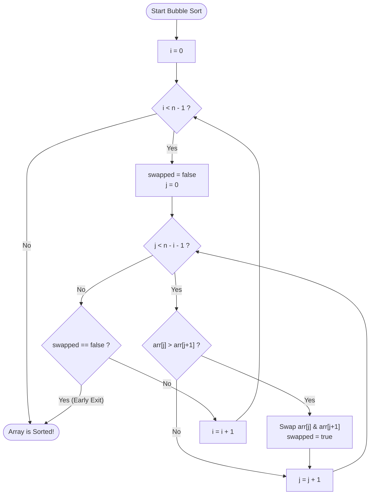

# Bubble Sort: Visual & Algorithmic Presentation

A complete presentation on the **Bubble Sort** algorithm — covering foundational intuition, step-by-step tracing, flowcharts, code implementations, optimizations, and complexity analysis.

---

````carousel
# Slide 1: Welcome & Overview

## Bubble Sort: The Foundation of Sorting Algorithms

> A simple, comparison-based sorting algorithm that repeatedly steps through a list, compares adjacent elements, and swaps them if they are in the wrong order.

```
       [ 5 ]  [ 1 ]  [ 4 ]  [ 2 ]  [ 8 ]
           \  /
          Swap!
       [ 1 ]  [ 5 ]  [ 4 ]  [ 2 ]  [ 8 ]
                  \  /
                 Swap!
              ... and so on
```

### Presentation Roadmap
1. **The Core Intuition:** The physical metaphor of bubbles rising.
2. **How It Works:** The pass-by-pass mechanism and invariant.
3. **Step-by-Step Walkthrough:** Tracing an array with visual states.
4. **Flowchart & Logic:** Control flow of outer vs. inner loops.
5. **Code Implementations:** Python & JavaScript (Standard vs. Optimized).
6. **Complexity & Properties:** Big-O performance, stability, and memory.
7. **Pros, Cons & Real-World Context:** When to use and why it matters.

<!-- slide -->
# Slide 2: The Core Intuition

## Why "Bubble" Sort?

Think of carbonated bubbles in a glass of soda: **larger bubbles rise to the surface faster than smaller ones.**

```
       Surface (End of Array)
              ▲
              │   🫧 [ 8 ]  <-- Largest element "bubbles up" to the top
              │   🫧 [ 5 ]
              │   🫧 [ 4 ]
              │   🫧 [ 2 ]
              │   🫧 [ 1 ]
       Bottom (Start of Array)
```

### The Three Golden Rules
1. **Adjacent Comparisons:** Only compare elements next to each other: `arr[j]` and `arr[j + 1]`.
2. **Local Swaps:** If `arr[j] > arr[j + 1]`, swap them.
3. **The Guarantee (Loop Invariant):** After each complete pass $i$, the $i$-th largest element is guaranteed to be settled in its final sorted position at the end of the array.

> [!NOTE]
> Because the largest elements "bubble" to the end first, the unsorted portion of the array shrinks from right to left with each pass.

<!-- slide -->
# Slide 3: Step-by-Step Walkthrough (Pass 1)

## Initial Array: `[5, 1, 4, 2, 8]`

Let's watch how Pass 1 progresses through adjacent pairs:

| Step | Comparison | Elements | Action | Array State |
|:---:|:---:|:---:|:---:|:---|
| **0** | *Initial* | — | — | `[ 5, 1, 4, 2, 8 ]` |
| **1** | `arr[0]` vs `arr[1]` | `5 > 1` | **SWAP** | `[ 1, 5, 4, 2, 8 ]` |
| **2** | `arr[1]` vs `arr[2]` | `5 > 4` | **SWAP** | `[ 1, 4, 5, 2, 8 ]` |
| **3** | `arr[2]` vs `arr[3]` | `5 > 2` | **SWAP** | `[ 1, 4, 2, 5, 8 ]` |
| **4** | `arr[3]` vs `arr[4]` | `5 < 8` | **KEEP** | `[ 1, 4, 2, 5, 8 ]` |

```
Pass 1 Result:
[ 1,  4,  2,  5, |  8  ]
 └─ Unsorted ──┘    └── Sorted (Bubbled to end)
```

> [!TIP]
> Notice how the number `5` was carried along through multiple swaps until it encountered `8`, which was even larger. The largest item `8` is now permanently in place.

<!-- slide -->
# Slide 4: Completing Passes 2, 3 & 4

## Continuing to Sort: `[1, 4, 2, 5, 8]`

### Pass 2 (Target: lock 2nd largest element)
- Compare `1` & `4`: `1 < 4` $\rightarrow$ Keep $\rightarrow$ `[1, 4, 2, 5, 8]`
- Compare `4` & `2`: `4 > 2` $\rightarrow$ **Swap** $\rightarrow$ `[1, 2, 4, 5, 8]`
- Compare `4` & `5`: `4 < 5` $\rightarrow$ Keep $\rightarrow$ `[1, 2, 4, 5, 8]`
- **Pass 2 Result:** `[1, 2, 4, | 5, 8]` (Elements `5` and `8` are locked).

### Pass 3 (Target: lock 3rd largest element)
- Compare `1` & `2`: `1 < 2` $\rightarrow$ Keep $\rightarrow$ `[1, 2, 4, 5, 8]`
- Compare `2` & `4`: `2 < 4` $\rightarrow$ Keep $\rightarrow$ `[1, 2, 4, 5, 8]`
- **Zero swaps made in this pass!** The array is already completely sorted.

```
Final Array:
[ 1,  2,  4,  5,  8 ]  ✅ Sorted in 3 passes
```

<!-- slide -->
# Slide 5: Algorithm Flowchart

## How the Algorithm Decides



<!-- slide -->
# Slide 6: Standard vs. Optimized Code

## Python Implementation

```python
def bubble_sort_optimized(arr: list[int]) -> list[int]:
    n = len(arr)
    
    for i in range(n - 1):
        # Flag to detect if any swaps occurred in this pass
        swapped = False
        
        # Last i elements are already in place, no need to re-check them
        for j in range(n - 1 - i):
            if arr[j] > arr[j + 1]:
                # Swap adjacent elements
                arr[j], arr[j + 1] = arr[j + 1], arr[j]
                swapped = True
        
        # If no elements were swapped, array is already sorted!
        if not swapped:
            break
            
    return arr
```

### Key Optimizations Explained
- **`n - 1 - i` Inner Loop Bound:** Skips the already-sorted elements at the end, cutting total operations roughly in half.
- **`swapped` Flag (Early Exit):** Detects if an already-sorted or nearly-sorted array is supplied, terminating in $O(n)$ time instead of wasting $O(n^2)$ comparisons.

<!-- slide -->
# Slide 7: JavaScript Implementation

## Modern JavaScript (ES6+)

```javascript
/**
 * In-place optimized Bubble Sort
 * @param {number[]} arr
 * @returns {number[]}
 */
function bubbleSort(arr) {
  const n = arr.length;

  for (let i = 0; i < n - 1; i++) {
    let swapped = false;

    for (let j = 0; j < n - 1 - i; j++) {
      if (arr[j] > arr[j + 1]) {
        // ES6 Destructuring Swap
        [arr[j], arr[j + 1]] = [arr[j + 1], arr[j]];
        swapped = true;
      }
    }

    // Early termination if no swaps happened
    if (!swapped) break;
  }

  return arr;
}

// Example usage:
const scores = [64, 34, 25, 12, 22, 11, 90];
console.log(bubbleSort(scores)); 
// Output: [11, 12, 22, 25, 34, 64, 90]
```

<!-- slide -->
# Slide 8: Complexity & Performance Analysis

## Algorithmic Properties

| Metric | Complexity | Explanation / Condition |
|:---|:---:|:---|
| **Best Case Time** | $O(n)$ | Already sorted array (with early-exit `swapped` flag). Exactly $n-1$ comparisons, $0$ swaps. |
| **Average Case Time** | $O(n^2)$ | Random order: on average $\approx \frac{n(n-1)}{4}$ swaps and $\frac{n(n-1)}{2}$ comparisons. |
| **Worst Case Time** | $O(n^2)$ | Reverse-sorted array (e.g. `[5, 4, 3, 2, 1]`): Maximum possible swaps ($\frac{n(n-1)}{2}$). |
| **Space Complexity** | $O(1)$ | **In-place:** Only requires a single temporary variable for swapping. |
| **Stability** | **Stable** | Does not swap equal elements (`arr[j] > arr[j+1]`), preserving original relative order. |
| **Adaptive** | **Yes** | Adapts to pre-sorted inputs when using the early-exit flag. |

> [!IMPORTANT]
> The number of comparisons in unoptimized bubble sort is always:
> $$\sum_{k=1}^{n-1} k = \frac{n(n-1)}{2} \approx \frac{n^2}{2} = O(n^2)$$

<!-- slide -->
# Slide 9: Comparison with Other Sorting Algorithms

## Where Bubble Sort Stands

| Algorithm | Best Time | Avg Time | Worst Time | Space | Stable? | Practical Usage |
|:---|:---:|:---:|:---:|:---:|:---:|:---|
| **Bubble Sort** | $O(n)$ | $O(n^2)$ | $O(n^2)$ | $O(1)$ | Yes | Teaching / Education |
| **Insertion Sort** | $O(n)$ | $O(n^2)$ | $O(n^2)$ | $O(1)$ | Yes | Small datasets ($n < 30$), online streaming |
| **Selection Sort** | $O(n^2)$ | $O(n^2)$ | $O(n^2)$ | $O(1)$ | No | Minimizing number of memory writes ($O(n)$ writes) |
| **Merge Sort** | $O(n \log n)$ | $O(n \log n)$ | $O(n \log n)$ | $O(n)$ | Yes | Guaranteed $O(n \log n)$, linked lists |
| **Quick Sort** | $O(n \log n)$ | $O(n \log n)$ | $O(n^2)$ | $O(\log n)$ | No | Fast general-purpose internal sort |

> [!NOTE]
> Even among simple $O(n^2)$ algorithms, **Insertion Sort** almost always outperforms Bubble Sort in practice because it performs fewer comparisons and cache-friendly sequential writes.

<!-- slide -->
# Slide 10: Pros, Cons & Takeaways

## Summary & Key Takeaways

### Strengths
- **Simplicity:** Very easy to understand, visualize, and implement.
- **In-place ($O(1)$ Space):** Modifies the array directly without allocating extra memory.
- **Stable Sort:** Preserves original order of equal keys.
- **Fast on nearly-sorted data:** Optimized version finishes in $O(n)$ time.

### Weaknesses
- **$O(n^2)$ Time Complexity:** Inefficient for moderate to large collections ($n > 1,000$).
- **Excessive Swaps:** Excessive memory write operations compared to Selection Sort or Cycle Sort.

### The "Elevator Pitch" for Bubble Sort:
> *"Bubble sort repeatedly sweeps through the array, comparing neighbors and bubbling the heaviest element to the right, continuing until a clean pass with zero swaps signals that order is restored."*
````
